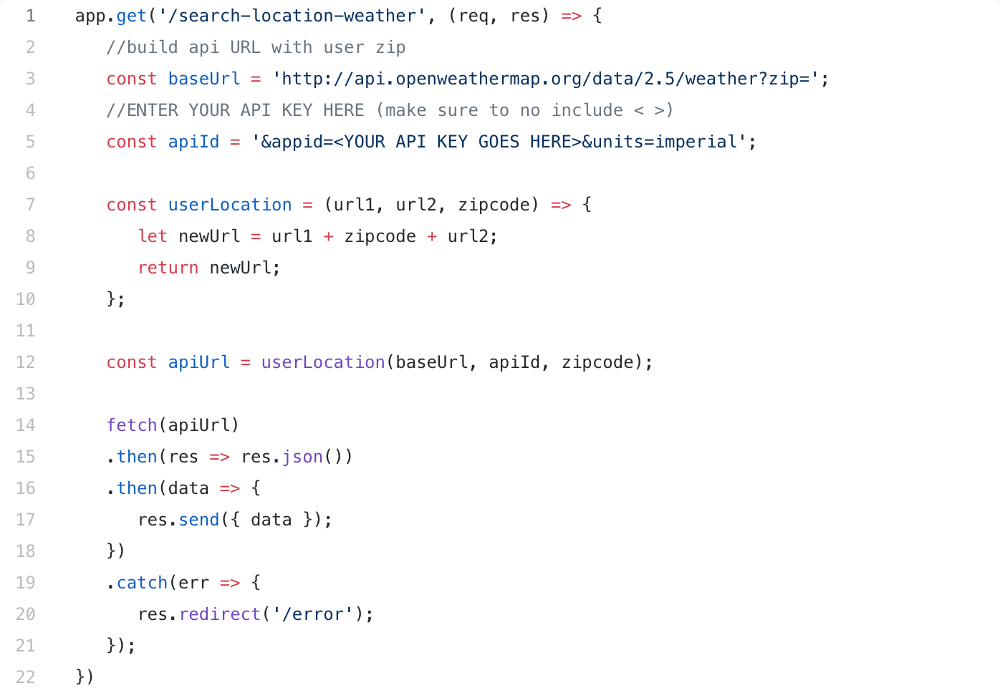
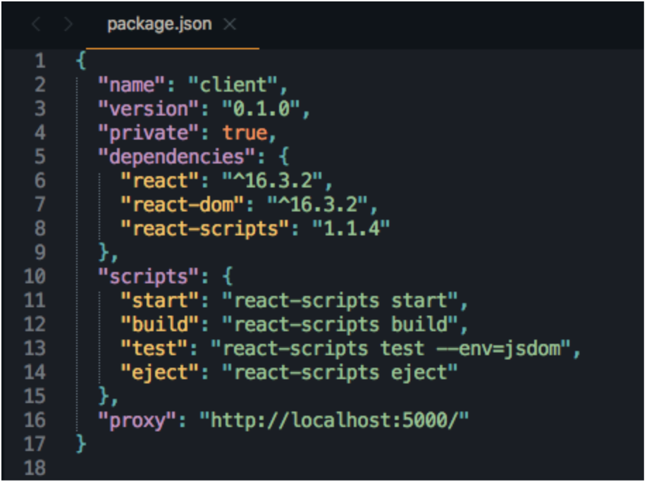
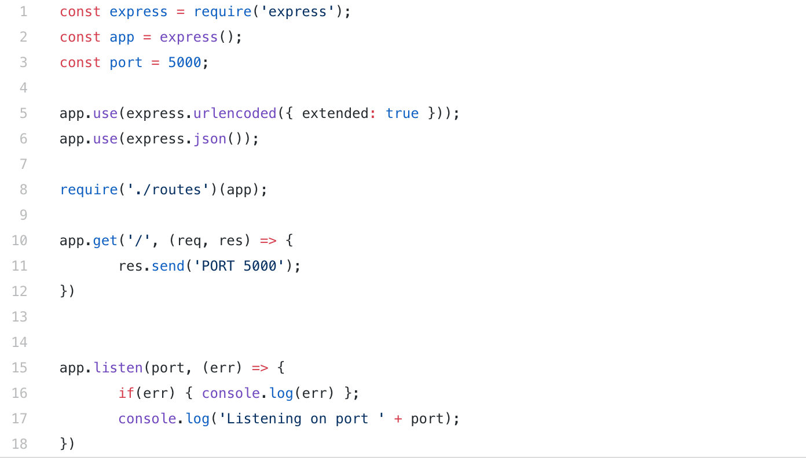

 Tired of needing to actually go outside to see what the weather is like? Annoyed by using the latest weather app and just can’t go on without making your own? **Probably not if I had to guess.**

 But there’s one certainty; you can learn a thing or two by making things. This simple weather app will will only display the current weather for an area. But, there is a lot to learn along the way of making it, especially if you haven’t done something like this yet! We have to create a frontend + backend, add routes, get data from a 3rd party API, use this API data with a React frontend, and we have to route React components around.

 There are way simpler ways to create this application; for instance we could accomplish it with just React alone. However, the two main points(and reasons) of this are to show how to set up routes in a backend server that can fetch 3rd party API data, and how to use this backend with a React frontend.

 Below, we start by creating a backend Express server that fetches weather data from a weather API, and we end with creating a React frontend that receives this weather data from the backend. The React side of this was bootstrapped with the lovely `create-react-app`. And an API provided by [Open Weather Map](www.openweathermap.org/api) will send current weather data (by location) into the backend.

 To get started, I like to talk through and breakdown a project into smaller, more digestible chunks. More times than not, deconstructing something into smaller pieces can make it seem way less daunting, and definitely can give a more clear direction of where to start.

 #### The basic gist of this weather application:

  * We will need to set up a backend (Express) server that connects to a front end client (React).

  * Can’t have a weather app with no weather data! So we will make use of a 3rd party weather API to provide data. We need to connect to that API and use the returned weather data.

  * We have to collect the users zipcode and combine that with the weather API’s URL to request location specific data.

  * We need to validate the zipcode, and also account for any potential 404 errors when receiving data back from the weather API.

  * Finally we have to display the current weather using the weather API data. Using React, we will need to create a component that is responsible for a page that does this.

No simpler than that, this project has been broken down into a few basic bullet points that are way easier to digest than tackling it all head on.

# Yeah, yeah, yeah. Let’s get setup!

First, if you plan to follow along I would advise heading over to Github and cloning this project. [Grab it here](https://github.com/maisonm/weather_app_tutorial)!

As noted above, we will be using a 3rd party weather API from Open Weather Map to get weather data. I recommend checking out the docs for the API we will be using here at: [Open Weather Map](www.openweathermap.org/api). Take note of what the returned weather data looks like, and check out the ‘By Zip code’ section.

# *NOTE: YOU WILL NEED AN API KEY TO USE THE CLONED PROJECT!*

You can sign up for free (and with no payment details) here at: [Open Weather Map](www.openweathermap.org/api) to get access to an API key. I have zero affiliation with Open Weather Map, it just happens to be the API I use for weather stuff.

Once signed up, API keys will be available in the ‘API Keys’ section found inside your account’s homepage. You can then copy and paste the free API key into the application here in `/server/routes/api/SearchLocations.js`:

Make sure to redact the ‘< >’ from the URL string after you’ve pasted your API key. Normally your API key would be hidden away in an environment variable, but for this example, we’re just going to make it as straight forward as possible. Please note that you never want to expose your API keys in production.

## Installing dependencies

  * Once the repository is cloned locally, go ahead and access the `/weather_app_tutorial` directory from the terminal and run `npm install` to install the backend dependencies from the `package.json` file.

  * While still inside `/weather_app_tutorial` navigate into the `/client` directory and then do the same thing by running `npm install` to install all of the dependencies that are required for React.

Once the dependencies are installed, the boilerplate is ready! 

## The backend Express server

To get things started, we are going to set up the Express server that will be responsible for all of the backend routes, partly responsible for routing the pages, and will also be responsible for making calls to the 3rd party weather API.

Without the backend server, the React client would still run and do it’s thing regardless, it would just have zero connectivity to the backend (duh!). This is because React is running on it’s own server (port 3000), and actually connects to the backend (port 5000) by way of a proxy. This is important to know, because this is what is going to tie our frontend to it’s backend. If you check the `package.json` in the `/client directory`, you will see where this proxy has been added:

After installing all of the dependencies above, Express will now be available to use. In the root directory locate `/server/server.js` and open it up:

This is a quick and easy Express server that runs on port 5000.

Let’s start it to make sure everything is working. From the terminal navigate into /server and run node server.js to start up the Express server. If you head over to `http://localhost:5000/` in your web browser, you should see ‘PORT 5000’. This confirms the server is up and running.

## Setting up the API routes
Yeah, we could technically set up all of our routes in `server.js` like a bunch of cavemen, but fortunately we aren’t cavemen. A more organized approach is to set up a `/routes` directory that server.js can import routes from!

To overview: The `/routes` directory will contain any routes we need to create for this application, and then we will set up `server.js` to import those routes so that our front end client (React) can use them.

First we will set up the API route that is responsible for fetching weather data from the 3rd party weather API:

Open up the `SearchLocations.js` file that is located in the `/routes/api` directory. This file will eventually handle calling the weather API and capturing the users zip code from the home page (more on that later).

Now open up and take a look at `SearchLocations.js`.

At first glance, we are creating a module that can be exported. This module will eventually be imported elsewhere making the routes available for use where ever they are imported.

Let’s breakdown what is going on with these `POST` and `GET` routes:

**NOTE**

Please visit [Full Post](https://medium.com/@maison.moa/create-a-simple-weather-app-using-node-js-express-and-react-54105094647a) to see the remainder of this post. **Currently the blog section is under construction!** So some styles may be wonky.